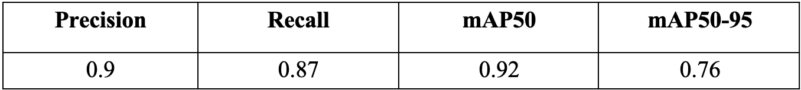
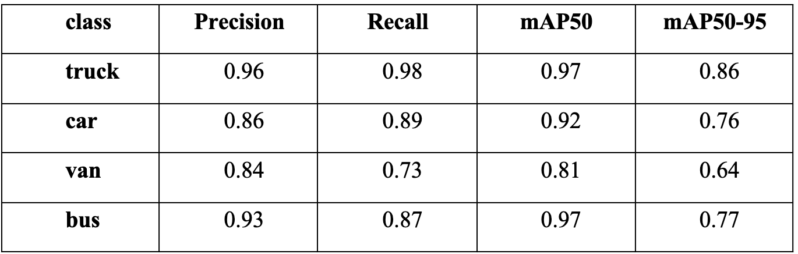
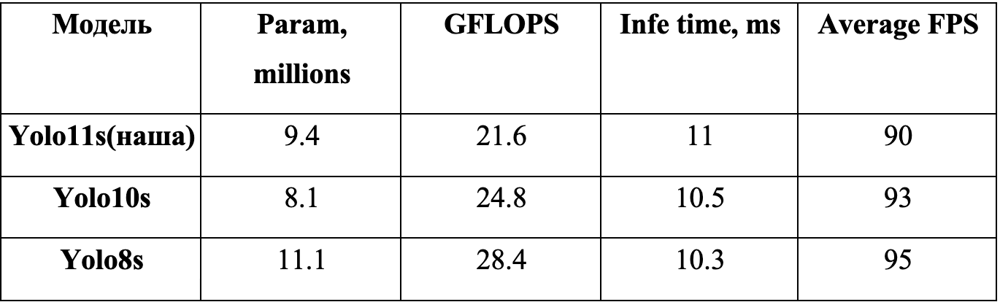
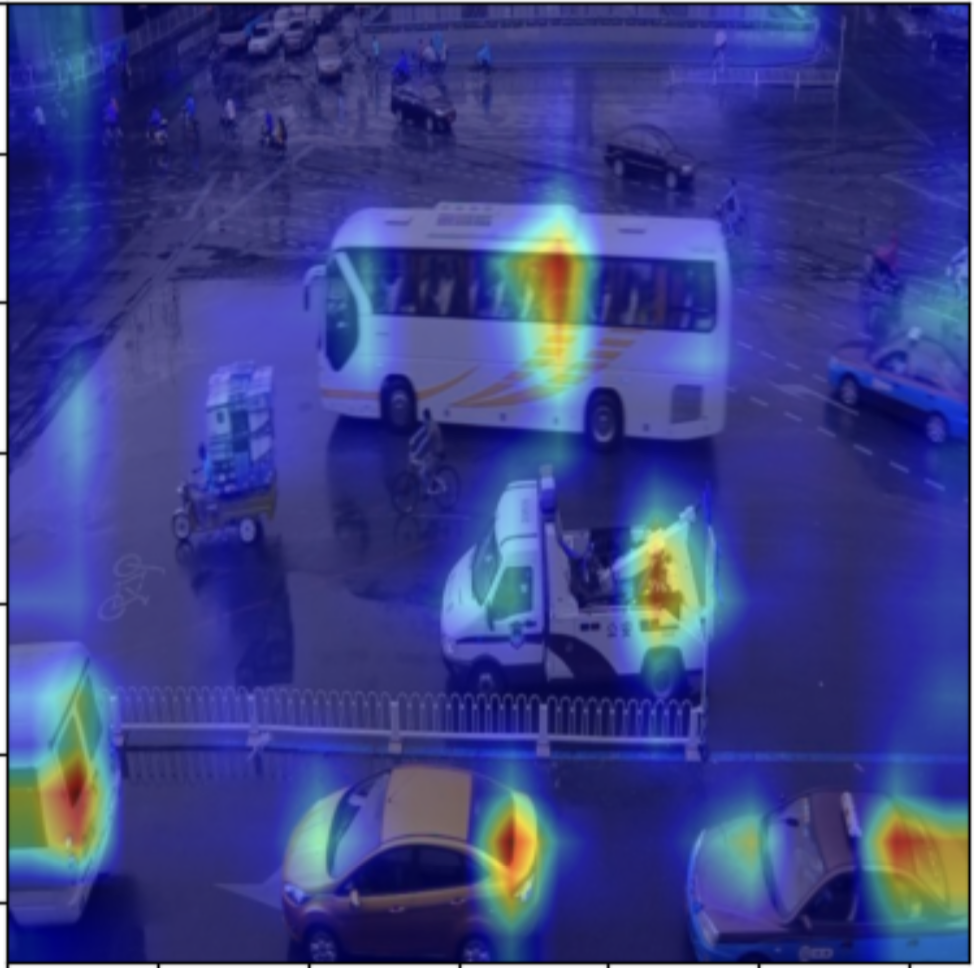
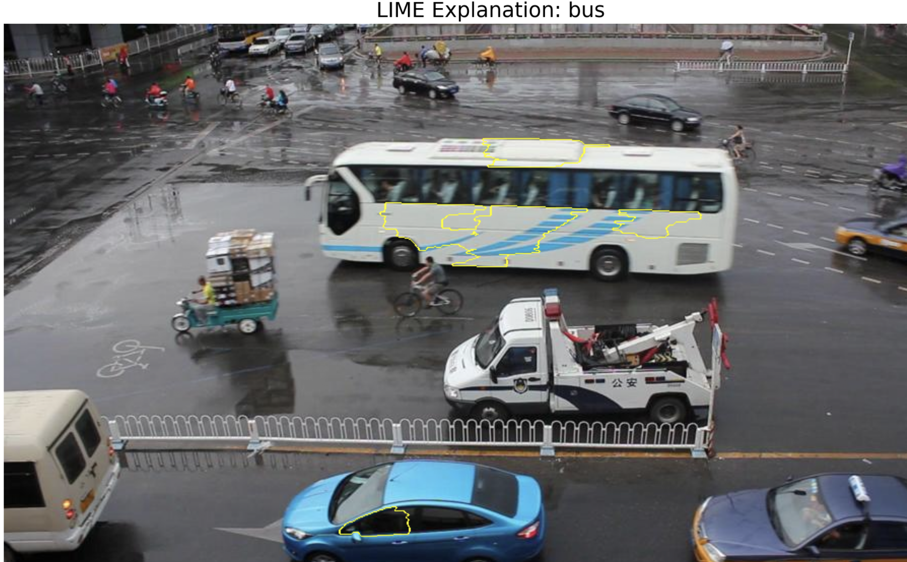
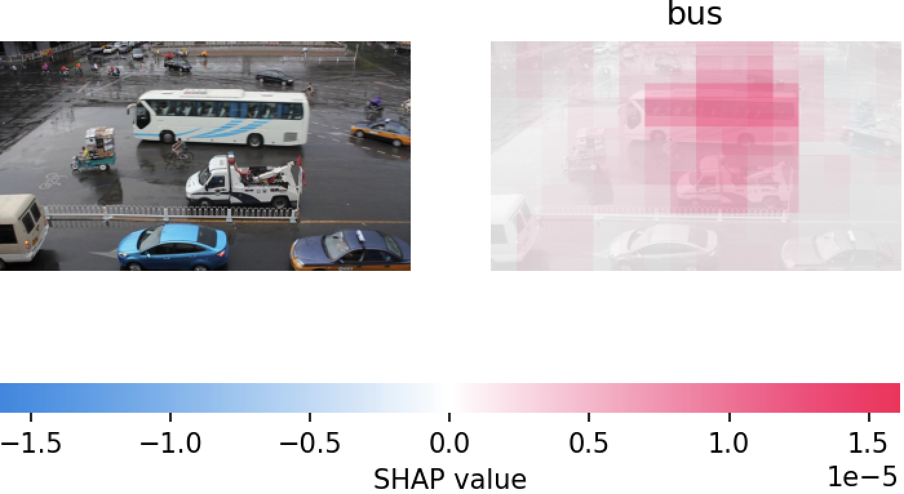
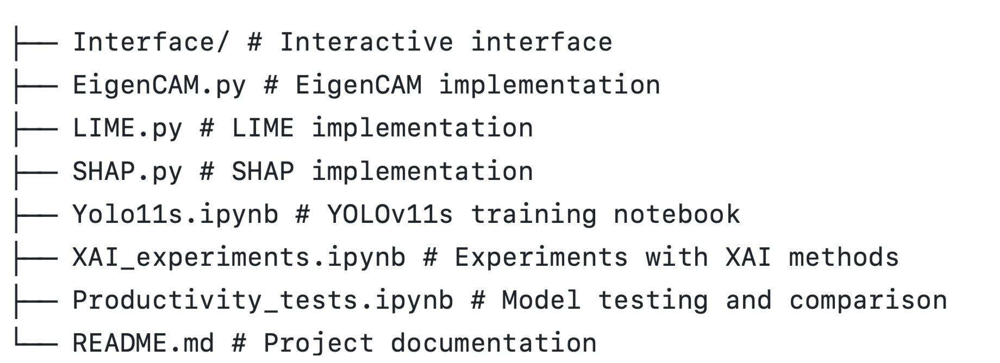

# Integration of Explainable Artificial Intelligence into Video Surveillance Systems for Automatic Object Classification and Tracking

This repository contains the software implementation of a bachelor's qualification project focused on developing a video analytics system integrated with explainable artificial intelligence (XAI) methods. The main objective is to enable not only effective object detection and tracking, but also interpretable model decision-making to enhance transparency and trust in the system.

---

## 📂 Input Data

As the source of video data, the **[UA-DETRAC dataset](https://www.kaggle.com/datasets/dtrnngc/ua-detrac-dataset)** was used — a realistic collection of videos captured under various conditions (day/night scenes, rain, shadows, etc.), containing over **1.2 million frames** with detailed annotations for four vehicle classes: `car`, `van`, `bus`, `others`.

---

## 🧠 Detection Model

For the task of object detection and classification, the project uses the **YOLOv11s** model — a state-of-the-art architecture in the YOLO series, designed for high accuracy with low computational complexity. The model was trained on a portion of the UA-DETRAC dataset with optimized hyperparameters to ensure maximum efficiency in real-time performance.

---

## 🧾 Applied XAI Methods

To interpret the model's predictions, three modern explainable AI approaches were implemented:

- **EigenCAM** — a gradient-free method that generates heatmaps based on projections of spatial features via PCA.
- **LIME (Local Interpretable Model-agnostic Explanations)** — explains individual predictions by fitting a local interpretable model around each instance.
- **SHAP (SHapley Additive exPlanations)** — evaluates the contribution of each input segment to the model's output using Shapley values from cooperative game theory.

Each method is visualized across multiple examples, allowing in-depth analysis of the model’s behavior and decision rationale.

---

## 📊 Model Training Results

Below is the result of training the YOLOv11s model, including validation accuracy metrics and productivity tests:

- Training Results

- Training Results for every class

- Video Processing Results

---

## 🧠 XAI Visualization Examples

Each XAI method was applied to selected frames to visualize the interpretability of the detection system:

- **EigenCAM**:
  
  

- **LIME**:

  

- **SHAP**:

  

---

## 📌 Repository Structure

---

## 📬 Contact

**Oleh Chovhaniuk**  
Student of group KN-417  
Lviv Polytechnic National University  
Email: oleh.chovhaniuk.kn.2021@lpnu.ua
